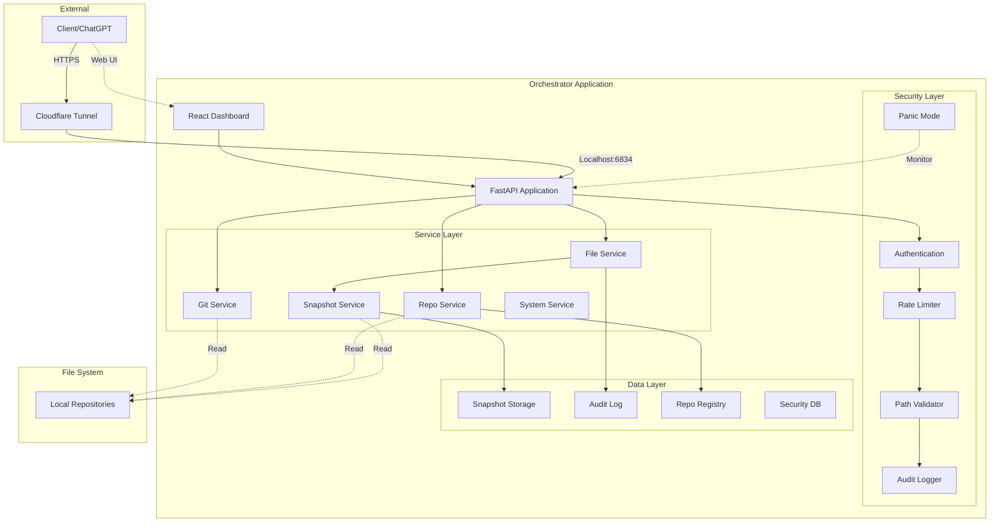
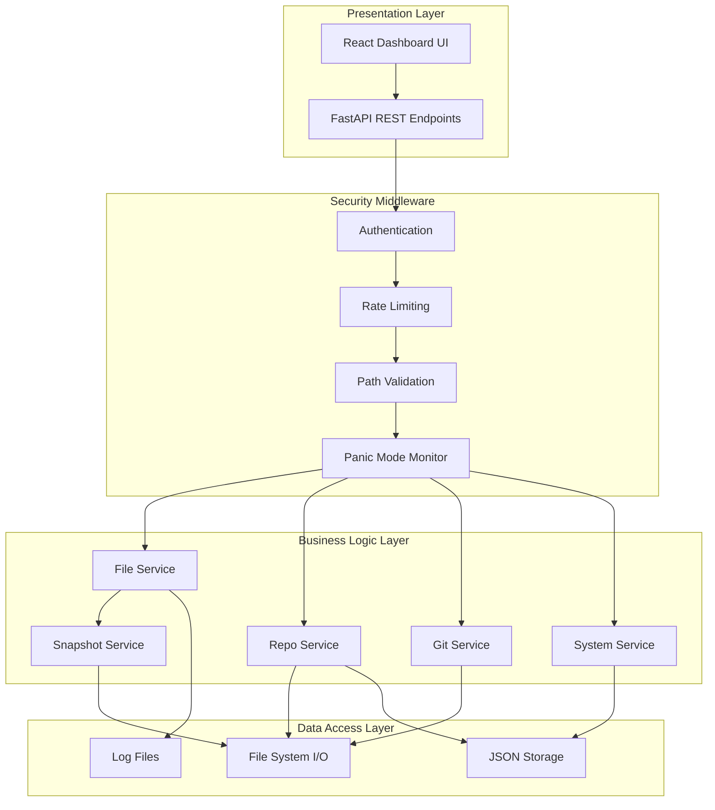
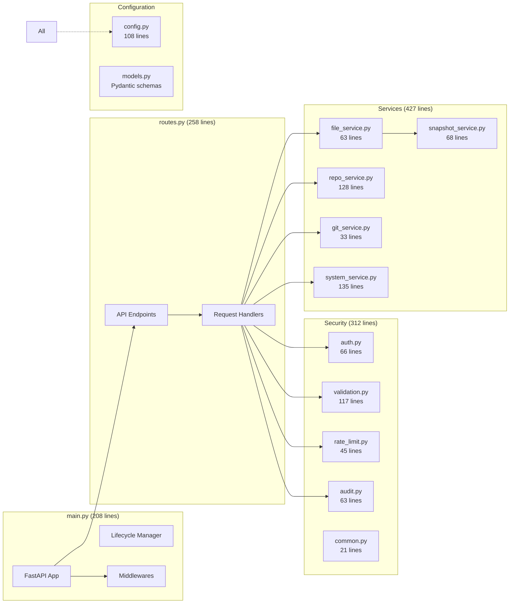
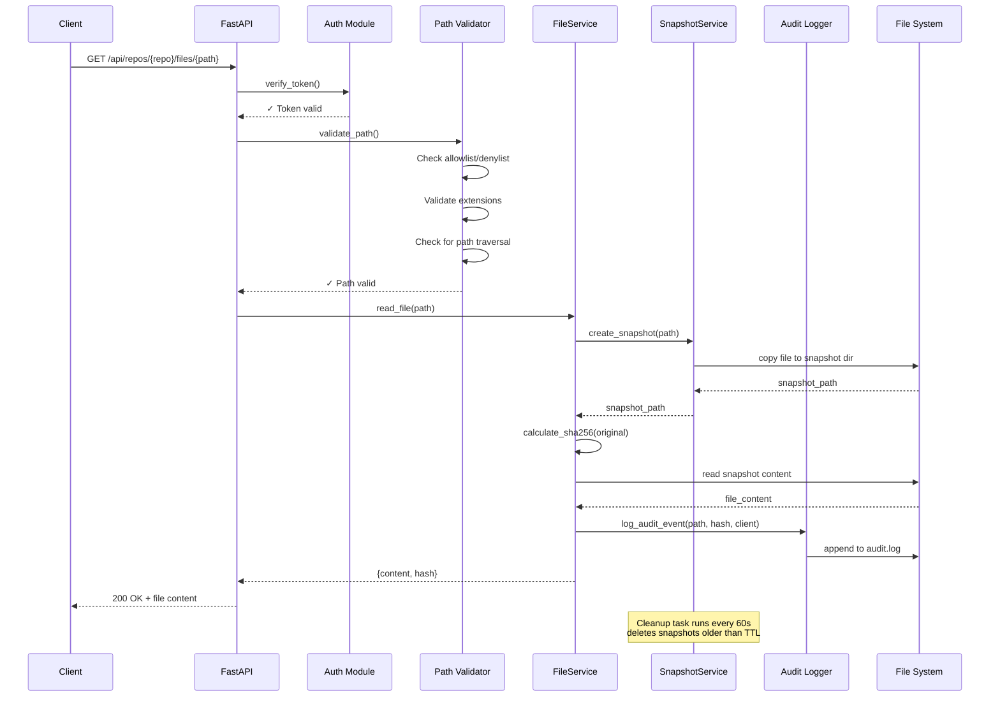
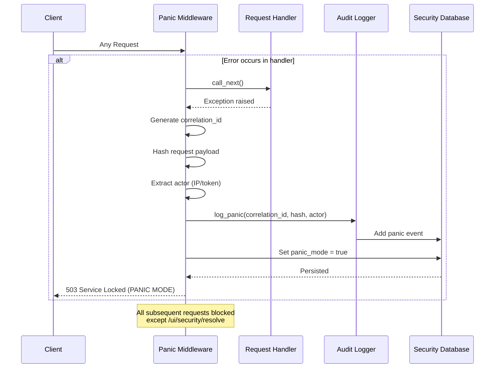
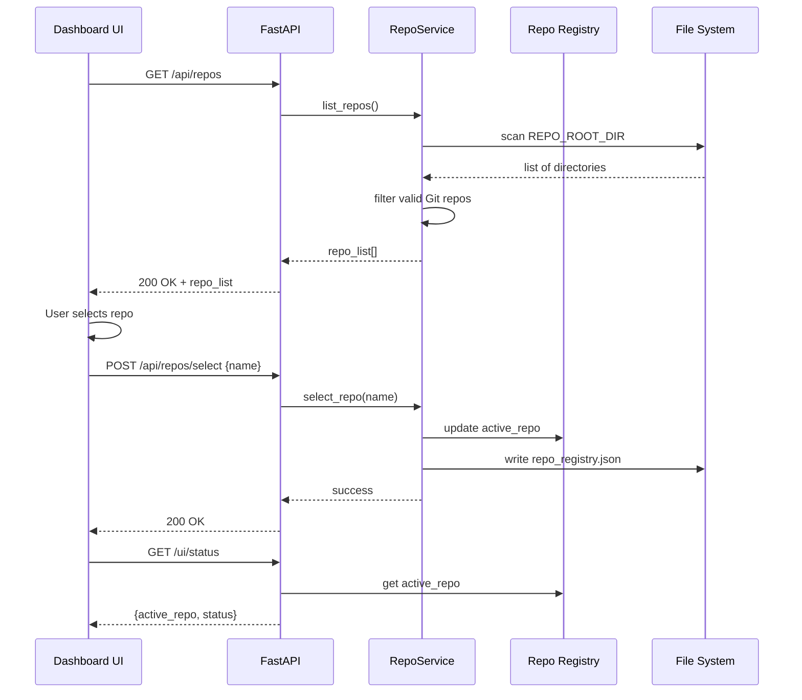
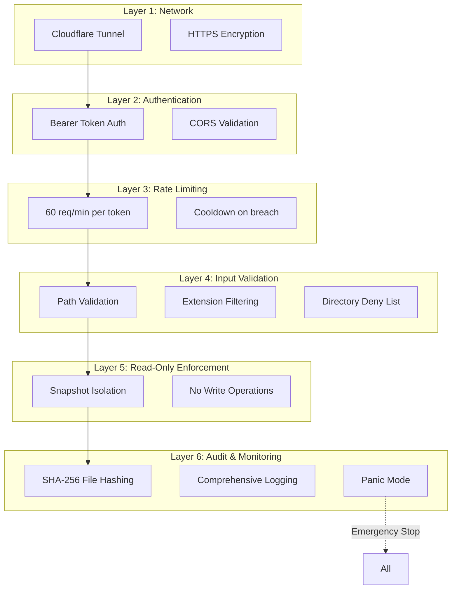
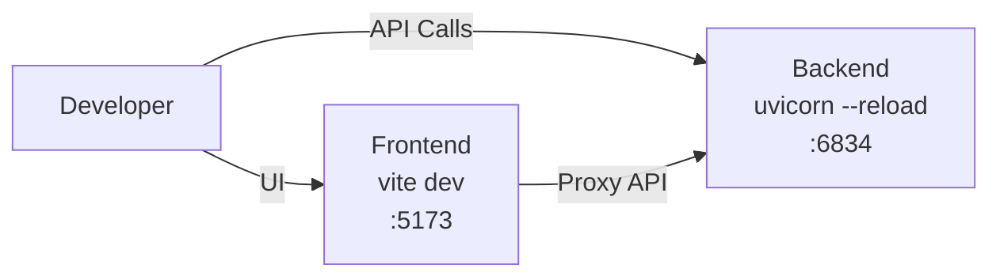
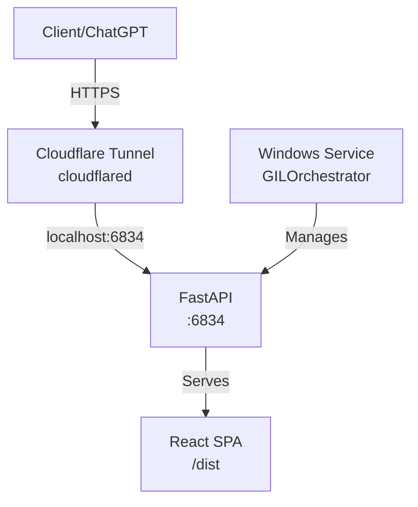
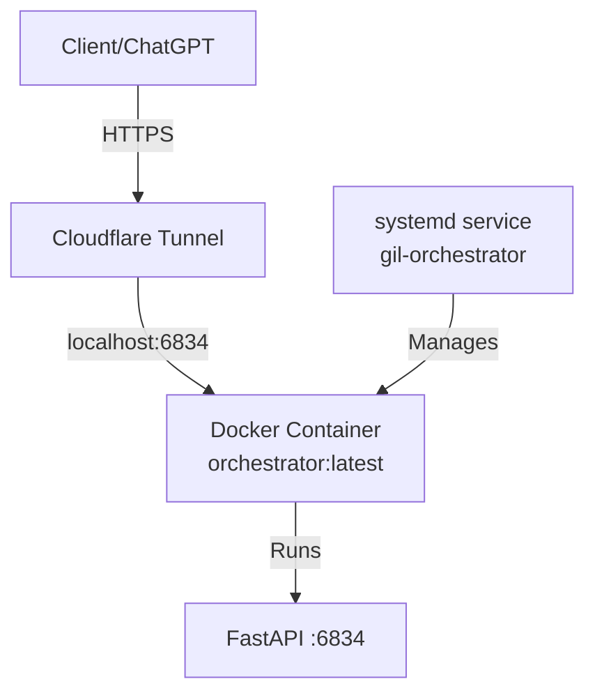

# Architecture Documentation - Gred Repo Orchestrator

This document provides a comprehensive overview of the Gred Repo Orchestrator architecture, including system design, components, data flows, and security considerations.

## Table of Contents

- [Overview](#overview)
- [System Architecture](#system-architecture)
- [Component Diagram](#component-diagram)
- [Data Flow](#data-flow)
- [Security Architecture](#security-architecture)
- [Module Descriptions](#module-descriptions)
- [Design Patterns](#design-patterns)
- [API Architecture](#api-architecture)
- [Deployment Architecture](#deployment-architecture)

---

## Overview

### Purpose

Gred Repo Orchestrator is a **secure, read-only repository management system** designed to expose local Git repositories through Cloudflare tunnels with comprehensive auditing and security controls.

### Key Characteristics

- **Read-Only by Design**: Operates exclusively in snapshot-based read mode
- **Security-First**: Multi-layered security with SHA-256 auditing, path validation, and panic mode
- **Zero-Trust**: All operations require authentication and rate limiting
- **Audit Trail**: Every file read is logged with cryptographic hashing
- **Snapshot Isolation**: Clients access temporary copies, never original files

### Technology Stack

| Layer | Technology |
|-------|------------|
| Backend Framework | FastAPI (Python 3.11+) |
| Frontend | React 18 + TypeScript + Vite |
| Styling | Tailwind CSS |
| Testing | pytest (Backend), Vitest (Frontend) |
| Security | Custom auth, rate limiting, path validation |
| Tunneling | Cloudflare Tunnel (cloudflared) |
| Service Management | Windows Service / PowerShell |

---

## System Architecture

### High-Level Architecture



### Layered Architecture



---

## Component Diagram

### Core Components



---

## Data Flow

### File Read Flow (Critical Path)



### Panic Mode Activation Flow



### Repository Selection Flow



---

## Security Architecture

### Defense in Depth



### Security Modules

#### 1. Authentication (`auth.py`)

- **Bearer Token**: UUID-based token stored in `.env`
- **Auto-generation**: Token created if missing
- **Validation**: Every request except public endpoints
- **No Expiration**: Stateless, regenerate to rotate

```python
# Simplified flow
def verify_token(authorization: str = Header(...)):
    expected = os.environ.get("ORCH_TOKEN")
    provided = extract_bearer_token(authorization)
    if not secrets.compare_equal(expected, provided):
        raise HTTPException(401, "Invalid token")
    return provided
```

#### 2. Path Validation (`validation.py`)

**Validation Checks:**
1. **Allowlist** (if enabled): Path must be in TTL-based allowlist
2. **Extension Check**: Must be in `ALLOWED_EXTENSIONS`, not in `DENIED_EXTENSIONS`
3. **Directory Check**: Cannot contain `DENIED_DIRS` segments
4. **Path Traversal**: Resolved path must be within base directory
5. **Symlink Detection**: Rejects symlinks to prevent escaping

```python
# Validation layers
def validate_path(path: Path, base_dir: Path) -> None:
    # 1. Check allowlist (if required)
    # 2. Check extension whitelist/blacklist
    # 3. Check denied directories
    # 4. Resolve and verify within base_dir
    # 5. Reject if symlink
```

#### 3. Rate Limiting (`rate_limit.py`)

- **Window**: 60 seconds (configurable)
- **Limit**: Configurable per window
- **Storage**: In-memory dictionary
- **Cleanup**: Automatic expiration of old entries
- **Response**: 429 Too Many Requests

#### 4. Audit Logging (`audit.py`)

Every file access generates an audit entry:

```json
{
  "timestamp": "2026-01-31T23:45:12Z",
  "action": "read_file",
  "path": "/repos/myproject/src/main.py",
  "sha256": "a3b2c1...",
  "client": "ChatGPT",
  "status": "success"
}
```

Stored in: `logs/orchestrator_audit.log`

#### 5. Panic Mode (`main.py` middleware)

**Triggers:**
- Unhandled exception in request handler
- Critical security event (extensible)

**Effects:**
- All endpoints blocked except `/ui/security/resolve`
- State persisted to `security.json`
- Requires manual resolution

**Resolution:**
- Admin reviews panic event
- Takes action: `resolve` or `dismiss`
- System resumes normal operation

---

## Module Descriptions

### Backend Modules

#### `main.py` (208 lines)
**Purpose:** FastAPI application entry point and lifecycle management

**Key Functions:**
- `lifespan()`: Async context manager for startup/shutdown
- `snapshot_cleanup_loop()`: Background task for snapshot TTL enforcement
- `panic_mode_check()`: Middleware to enforce panic mode
- `serve_spa()`: Serve React frontend from `/dist`

**Responsibilities:**
- Initialize FastAPI app
- Register routes and middlewares
- Start background tasks
- Handle application lifecycle

---

#### `routes.py` (258 lines)
**Purpose:** API endpoint definitions and request handlers

**Endpoints:**
| Endpoint | Method | Purpose |
|----------|--------|---------|
| `/api/status` | GET | Health check |
| `/ui/status` | GET | Dashboard status (detailed) |
| `/api/repos` | GET | List available repositories |
| `/api/repos/select` | POST | Set active repository |
| `/api/repos/{repo}/files/{path}` | GET | Read file with audit |
| `/api/repos/{repo}/tree` | GET | List directory tree |
| `/api/repos/{repo}/git/log` | GET | Git commit history |
| `/ui/security/events` | GET | Security event log |
| `/ui/security/resolve` | POST | Resolve panic mode |

**Handlers:**
- Input validation
- Service layer invocation
- Error handling
- Response formatting

---

#### `config.py` (108 lines)
**Purpose:** Centralized configuration management

**Key Configurations:**
- `BASE_DIR`: Installation directory
- `REPO_ROOT_DIR`: Parent directory of all repos
- `ALLOWED_EXTENSIONS`: `.ts`, `.tsx`, `.py`, `.go`, `.rs`, `.c`, `.cpp`, `.json`, `.yaml`
- `DENIED_EXTENSIONS`: `.md`, `.rst`, `.txt`, `.env`, `.pem`, `.key`
- `DENIED_DIRS`: `.git`, `node_modules`, `.venv`, `__pycache__`, `dist`, `build`
- `SNAPSHOT_DIR`: Temporary file storage (`.orch_snapshots`)
- `SNAPSHOT_TTL`: 240 seconds (4 minutes)

---

#### `models.py`
**Purpose:** Pydantic schemas for request/response validation

**Key Models:**
- `StatusResponse`: API status information
- `UiStatusResponse`: Dashboard status with metrics
- `VitaminizeResponse`: Repo refresh operation result
- (Additional models for repos, files, etc.)

---

### Security Modules

#### `security/auth.py` (66 lines)
- Token generation
- Token validation
- Bearer token extraction
- Secure comparison using `secrets.compare_digest()`

#### `security/validation.py` (117 lines)
- Path validation logic
- Allowlist/denylist enforcement
- Extension filtering
- Symlink detection
- Path traversal prevention

#### `security/rate_limit.py` (45 lines)
- Request counting per token
- Time window management
- Rate limit enforcement
- Cleanup of expired entries

#### `security/audit.py` (63 lines)
- Audit event generation
- Log file management
- Panic event logging
- Structured JSON logging

#### `security/common.py` (21 lines)
- Shared security utilities
- Database load/save (JSON)
- Common security helpers

---

### Service Layer

#### `services/file_service.py` (63 lines)
**Purpose:** File operations with security and auditing

**Key Methods:**
- `read_file(path)`: Read file via snapshot with SHA-256 audit
- `list_directory(path)`: List directory contents with filtering
- `tail_audit_lines(limit)`: Read recent audit log entries
- `calculate_hash(file)`: SHA-256 hash computation

---

#### `services/repo_service.py` (128 lines)
**Purpose:** Repository management and discovery

**Key Methods:**
- `list_repos()`: Scan and list available repositories
- `select_repo(name)`: Set active repository
- `get_active_repo()`: Retrieve current active repo
- `validate_repo(path)`: Check if directory is valid Git repo
- `vitaminize_repo()`: Refresh repository metadata

---

#### `services/git_service.py` (33 lines)
**Purpose:** Git operations (read-only)

**Key Methods:**
- `get_commit_log(repo_path, limit)`: Fetch commit history
- `get_branch_info(repo_path)`: Get current branch
- `get_repo_status(repo_path)`: Git status information

**Note:** All operations are read-only, no write capabilities

---

#### `services/snapshot_service.py` (68 lines)
**Purpose:** Snapshot-based file isolation

**Key Methods:**
- `create_snapshot(path)`: Create timestamped copy of file
- `cleanup_old_snapshots()`: Delete snapshots older than TTL
- `secure_delete(path)`: Overwrite file before deletion
- `ensure_snapshot_dir()`: Initialize snapshot directory

**Snapshot Naming:**
```
{timestamp_ms}_{path_hash}_{filename}
Example: 1738363512123_a3b2c1d4e5f6_main.py
```

---

#### `services/system_service.py` (135 lines)
**Purpose:** System-level operations and maintenance

**Key Methods:**
- `get_system_info()`: CPU, memory, disk usage
- `get_service_metrics()`: Uptime, request count, errors
- `perform_maintenance()`: Cleanup, validation, health checks
- `export_configuration()`: Backup configuration files

---

### Frontend (React)

#### Structure
```
src/
├── App.tsx                    # Root component, routing
├── main.tsx                   # Entry point
├── components/                # Reusable UI components
│   └── Accordion.tsx
├── hooks/                     # Custom React hooks
│   ├── useRepoService.ts      # Repo API client
│   ├── useSecurityService.ts  # Security API client
│   ├── useSystemService.ts    # System API client
│   └── useAuditLog.ts         # Audit log fetching
├── islands/                   # Self-contained island components
│   └── system/
│       └── MaintenanceIsland.tsx
└── types.ts                   # TypeScript type definitions
```

#### Islands Architecture

The frontend uses an **Islands Architecture** pattern:

- **Islands**: Self-contained components with their own state and logic
- **Hydration**: Each island hydrates independently
- **Performance**: Minimal JavaScript for non-interactive content
- **Modularity**: Easy to add/remove features

**Example Island:** `MaintenanceIsland.tsx`
- Displays system status
- Provides maintenance actions
- Handles panic mode resolution
- Fetches data independently

---

## Design Patterns

### 1. **Service Layer Pattern**
**Location:** `services/` directory

**Purpose:** Separate business logic from HTTP handling

**Benefits:**
- Testable without FastAPI dependencies
- Reusable across different endpoints
- Clear separation of concerns

**Example:**
```python
# routes.py (thin controller)
def read_file_handler(repo: str, path: str):
    return FileService.read_file(path)

# services/file_service.py (business logic)
class FileService:
    @staticmethod
    def read_file(path: Path) -> dict:
        # Validation, snapshot creation, hashing, audit
        ...
```

---

### 2. **Dependency Injection**
**Location:** FastAPI `Depends()`

**Purpose:** Inject security checks and dependencies

**Example:**
```python
@app.get("/api/repos")
def list_repos(
    token: str = Depends(verify_token),         # Auth check
    _: None = Depends(check_rate_limit)          # Rate limit check
):
    return RepoService.list_repos()
```

---

### 3. **Middleware Chain**
**Location:** `main.py`

**Purpose:** Process requests through security layers

**Order:**
1. CORS preflight handling
2. Panic mode enforcement
3. Request validation
4. Route handling
5. Exception catching

---

### 4. **Snapshot Pattern**
**Location:** `services/snapshot_service.py`

**Purpose:** Isolate reads from original files

**Benefits:**
- Read-only guarantee
- Forensic traceability
- TTL-based cleanup
- No file locking issues

---

### 5. **Fail-Closed Security**
**Location:** Panic mode implementation

**Purpose:** Default to safe state on errors

**Behavior:**
- Unhandled exception → Panic mode enabled
- All operations blocked
- Requires manual intervention
- Better safe than sorry

---

### 6. **Repository Pattern**
**Location:** `security/common.py`, registry/security DB

**Purpose:** Abstract data persistence

**Storage:** JSON files
- `repo_registry.json`: Active repo selection
- `security.json`: Security events, panic state
- `allowed_paths.json`: Dynamic allowlist

---

## API Architecture

### REST Principles

- **Stateless**: Each request contains all necessary information
- **Resource-Based**: URLs represent resources (`/repos/{repo}/files/{path}`)
- **Standard Methods**: GET for reads (no POST/PUT/DELETE for files)
- **JSON Responses**: Consistent response format

### Error Handling

**Standard Error Response:**
```json
{
  "detail": "Error message",
  "status_code": 400,
  "error_type": "ValidationError"
}
```

**Status Codes:**
- `200 OK`: Success
- `401 Unauthorized`: Invalid token
- `403 Forbidden`: Path validation failed
- `404 Not Found`: Resource doesn't exist
- `429 Too Many Requests`: Rate limit exceeded
- `503 Service Unavailable`: Panic mode active

---

## Deployment Architecture

### Development Mode



**Commands:**
```bash
# Backend
cd tools/repo_orchestrator
uvicorn main:app --reload --port 6834

# Frontend
cd tools/orchestrator_ui
npm run dev
```

---

### Production Mode (Windows)



**Startup Flow:**
1. `scripts/start_orch.cmd` executed
2. Activate virtual environment
3. Validate configuration (`.env`, directories)
4. Start uvicorn server on port 6834
5. Cloudflare tunnel connects
6. Service ready for requests

**Service Management:**
```powershell
# Install as Windows Service
.\scripts\manage_service.ps1 -Action Install

# Start service
.\scripts\manage_service.ps1 -Action Start

# Monitor logs
Get-Content logs\orchestrator.log -Tail 50 -Wait
```

---

### Future: Linux Deployment (Planned)



**Target Platform:** Ubuntu 22.04 LTS

**Deployment Options:**
1. **Systemd Service** (native)
2. **Docker Container** (recommended for portability)
3. **Docker Compose** (multi-container if needed)

**Scripts Linux añadidos:**
- `scripts/start_orch.sh` - Lanzador principal Linux
- `scripts/manage_service.sh` - Gestión de systemd
- `scripts/vitaminize_repo.sh` - Activación de repositorios

**Docker artifacts:**
- `Dockerfile`
- `docker-compose.yml`
- `.dockerignore`

---

## Security Considerations

### Threat Model

**Protected Against:**
- ✅ Unauthorized access (token auth)
- ✅ Path traversal attacks (validation)
- ✅ Symlink exploits (detection and rejection)
- ✅ Rate limiting bypass (per-token tracking)
- ✅ Sensitive file exposure (extension filtering)
- ✅ Unaudited reads (SHA-256 logging)
- ✅ Service overload (rate limiting, panic mode)

**Not Protected Against (Out of Scope):**
- ❌ Token compromise (rotate token if suspected)
- ❌ Cloudflare tunnel compromise (separate concern)
- ❌ Host system compromise (OS-level security)
- ❌ Physical access to server

### Security Best Practices

1. **Token Rotation**: Periodically regenerate `ORCH_TOKEN`
2. **Log Monitoring**: Review `orchestrator_audit.log` regularly
3. **Panic Mode Drills**: Test panic activation/resolution
4. **Dependency Updates**: Run `pip-audit` weekly
5. **Access Reviews**: Audit who has token access

---

## Performance Characteristics

### Bottlenecks

1. **Snapshot Creation**: I/O bound (file copy)
   - Mitigation: TTL-based cleanup, SSD storage recommended

2. **SHA-256 Hashing**: CPU bound for large files
   - Mitigation: Chunk-based reading (4KB chunks)

3. **Rate Limiting**: Memory storage
   - Mitigation: Periodic cleanup of old entries

### Optimization Opportunities

- [ ] **Caching**: Add Redis for frequently accessed files
- [ ] **Async I/O**: Use `aiofiles` for snapshot operations
- [ ] **Compression**: Gzip snapshots to save disk space
- [ ] **Database**: Move from JSON to SQLite for registry/security DB

---

## Testing Strategy

### Test Pyramid

```
        /\
       /  \    E2E Tests (Integration)
      /____\   - Fuzzing (test_fuzzing.py)
     /      \  - Chaos (test_load_chaos_resilience.py)
    /        \ - LLM Security (test_llm_security_leakage.py)
   /__________\
  /            \ Unit Tests (tests/unit/)
 /              \ - 97%+ coverage target
/________________\ - 128+ test cases
```

**Test Files:**
- `tests/unit/`: 12 files, 124 test cases
- `tests/`: Integration and security tests
- Coverage: Backend 86-100% for core modules

---

## References

### Internal Documentation
- [README.md](../README.md) - Project overview
- [DEVELOPMENT.md](./DEVELOPMENT.md) - Developer guide
- [STYLE_GUIDE.md](./STYLE_GUIDE.md) - Coding standards
- [SONAR.md](./SONAR.md) - SonarCloud configuration

### External Resources
- [FastAPI Documentation](https://fastapi.tiangolo.com/)
- [Cloudflare Tunnel Docs](https://developers.cloudflare.com/cloudflare-one/connections/connect-apps/)
- [OWASP ASVS](https://owasp.org/www-project-application-security-verification-standard/) - Security standards

---

**Document Version:** 1.0
**Last Updated:** January 31, 2026
**Maintainer:** Gred Orchestrator Team
